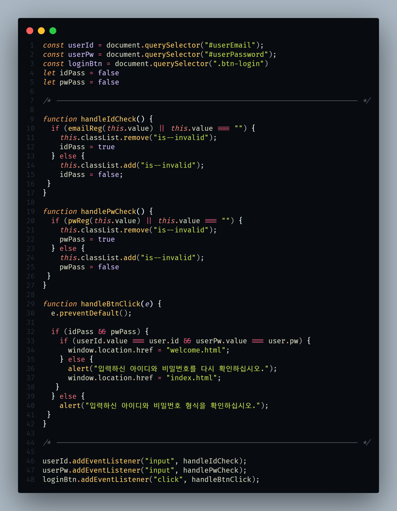

# 네이버 로그인 페이지 구현

로그인과 비밀번호를 정확히 입력했을 때 welcome 페이지로 넘어갈 수 있도록 코드 로직을 작성하였습니다.

 

---

 

## 조건

1. email / pw 정규표현식을 사용한 validation
2. 상태 변수 관리
3. 로그인 버튼을 클릭시 조건처리

 

## 결과

**1. email / pw 정규표현식을 사용한 validation**

 

**2. 상태 변수 관리 (상태 변수 확인을 통해 형식 확인 알림 메세지 출력)**

 

**3. 로그인 버튼을 클릭시 조건처리 (아이디 및 비밀번호 재확인 알림 메세지 출력)**

 

---

## Source Code

