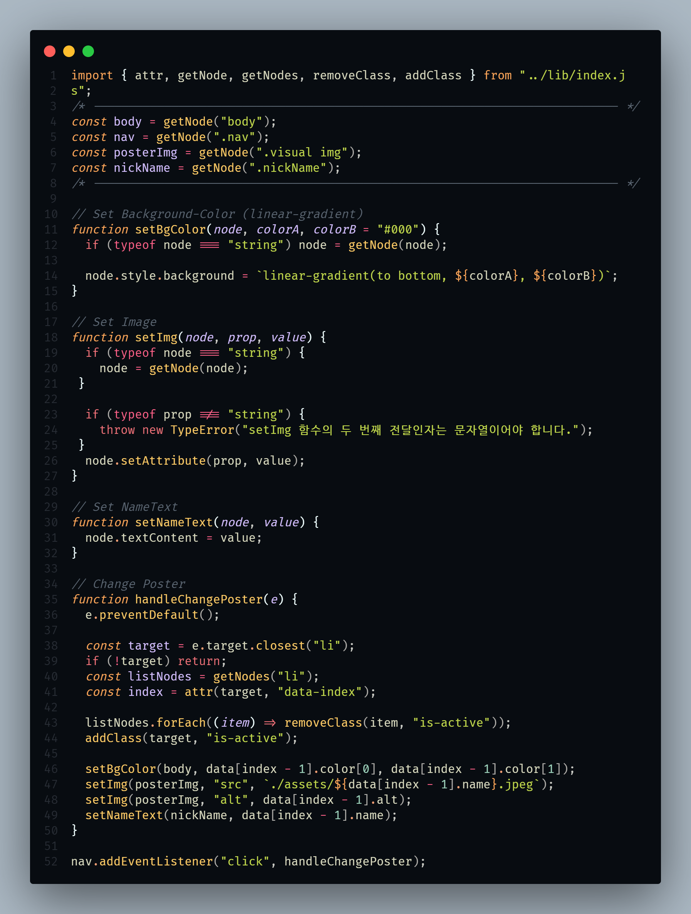

# "Elemental" 무비 포스터 페이지 구현

메인 포스터 아래 Pagination 이미지를 누르면 배경과 포스터 이미지가 변경될 수 있도록 구현하였습니다.

 

---

 

## 조건

1. 클릭 이벤트 활성화
2. nav 클릭시 배경 색상 변경
3. 이미지 변경
4. 텍스트 변경
5. 함수 분리

 

## 결과

---

## Source Code

